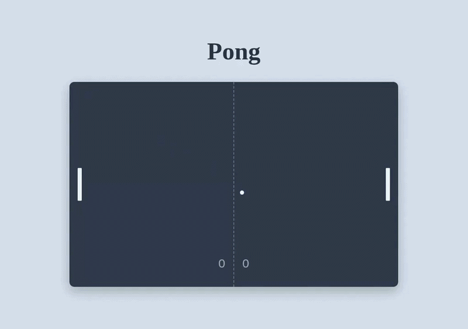

# Pong

This is a basic game of pong made in a single html file that has been shrunk into a URI under 3kb (2281 bytes to be exact). There is basic scoring and the ball and paddles speed up gradually as a rally goes on.




## How to Play

To play the game in your browser, go in the `dist/uri.txt` file and copy the URI into your web browser. Click enter and enjoy!

## How it Works

I've used a div as a container (the court) and the paddles and the ball are the children divs' of it. For collisions I've used hardcoded coordinates and scoring also just uses 2 variables. The ball and paddles speed up 5% on every successful paddle hit until the speed reaches 6 pixels per frame. The speed also resets back when a point is scored. I've used the Web Audio API to generate the beep sounds in the browser every time the ball hits something.

## Building

Run the following commands to build the URI

```
npm install
node build.mjs
```

